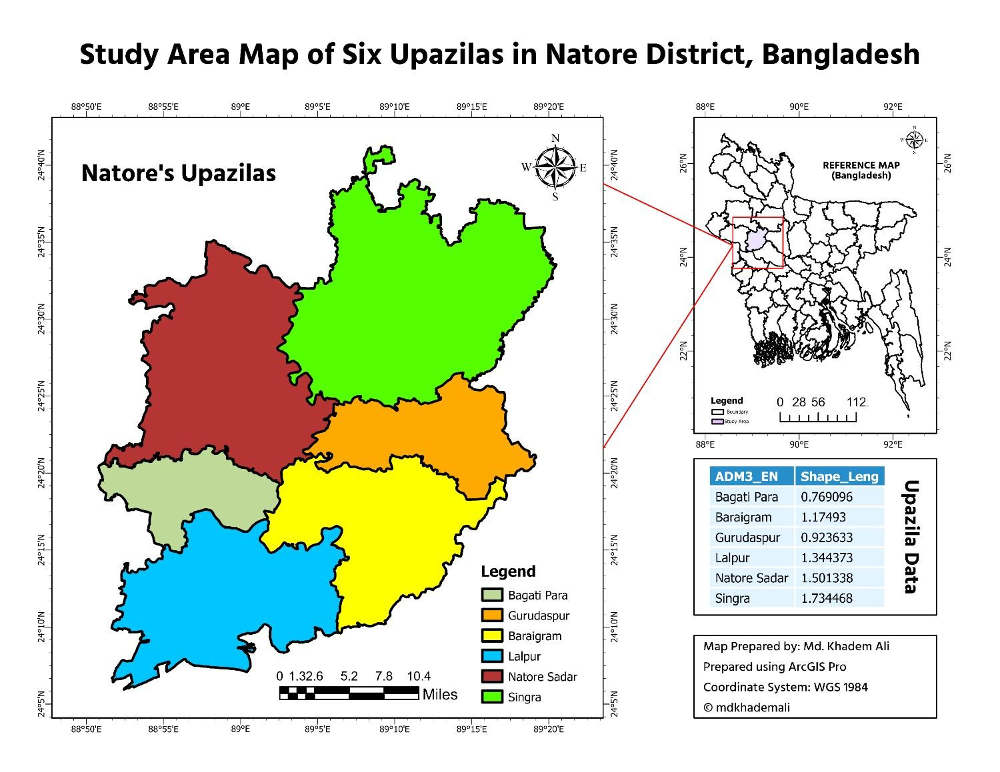
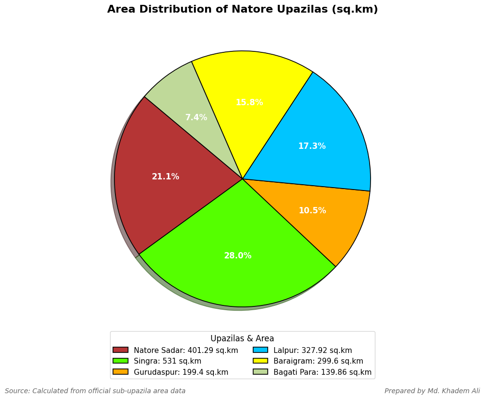
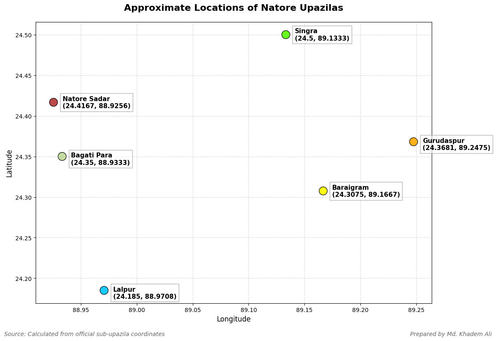

## GIS Visualization of Natore District, Bangladesh

This project visualizes **Natore District's upazilas** using both **area-based** and **coordinate-based** representations through Python (Matplotlib).  
It combines spatial and non-spatial data visualization for a comprehensive understanding of the study area.

---

## Study Area

**District:** Natore  
**Country:** Bangladesh  
**Number of Upazilas:** 6  
- Natore Sadar  
- Singra  
- Gurudaspur  
- Lalpur  
- Baraigram  
- Bagatipara  

### Study Area Map
Approximate map of Natore’s upazilas, based on their centroid coordinates.

---

## Upazila-wise Area Distribution

The bar (or pie) chart below shows the **area distribution** (in sq.km) of all upazilas in Natore District.

---

## Coordinate Locations of Upazilas

The following plot represents the **approximate geographic locations** of each upazila, labeled with their **latitude and longitude**.

---

## Data Summary

| Upazila | Latitude | Longitude |
|----------|-----------|-----------|
| Natore Sadar | 24.4167 | 88.9256 |
| Singra | 24.5000 | 89.1333 |
| Gurudaspur | 24.3681 | 89.2475 |
| Lalpur | 24.1850 | 88.9708 |
| Baraigram | 24.3075 | 89.1667 |
| Bagatipara | 24.3500 | 88.9333 |

> Coordinates are approximate centroid positions derived from official sub-district geographic data.

---

## Tools and Libraries

| Tool | Purpose |
|------|----------|
| **Python 3.x** | Data visualization and computation |
| **Matplotlib** | 2D plotting for both statistical and spatial data |
| **Google Colab / Jupyter Notebook** | Environment for running and experimenting with code |
| **GitHub** | Hosting and sharing open-source code and visuals |

---

---

## Code Overview

1. **`area-pie-chart.py`** – Visualizes each upazila’s area as a 3D bar/pie chart.  
2. **`coapproximate-locations.py`** – Plots geographic coordinates with upazila names and labels.  

Both scripts are designed for easy execution on **Google Colab** or **Jupyter Notebook**.

© mdkhademali